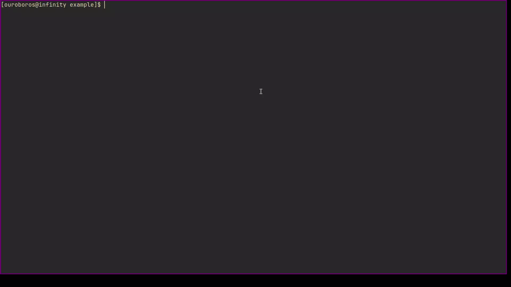

<h1 style="text-align: center;">Progress-Bar</h1>

<h3>About the Project</h3>
An incredibly simple ncurses implementation of a progress bar. The handling of terminal resizing is left up to the user

<h3>Getting Started</h3>
A sample program is available in the example directory

To use the program, just call the progress bar function with the following parameters:

- current data value
- the max possible data value 

Ncurses will have to be initalized and ended in the users program. This is so that control of the user window is in the hands of the user and does not have to be manipulated through separate functions.
